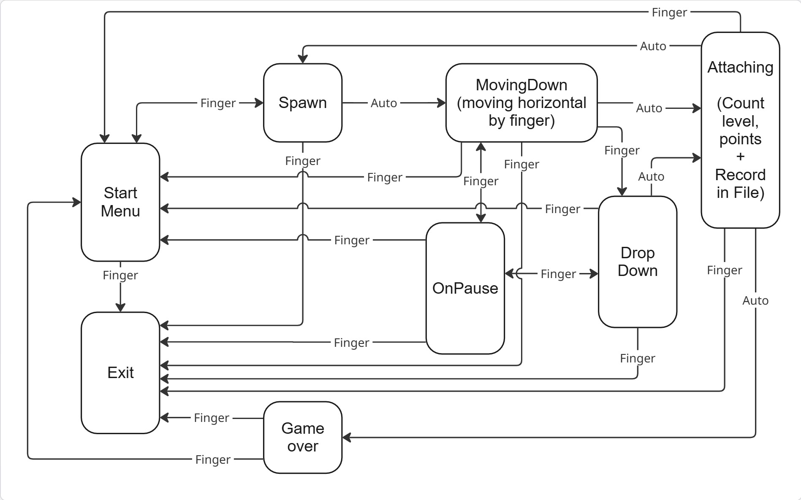

# Тетрис
Реализация игры «Тетрис» на языке С:
- Cтандарт не ранее C11 с использованием компилятора gcc.
- Программа состоит из двух частей: библиотека, которая реализующей логику игры тетрис, и терминальный интерфейс с использованием библиотеки `ncurses`.
- В формализации логики игры использован конечный автомат следующего вида:

- Код библиотеки программы находится в папке `brick_game/tetris`.
- Код с интерфейсом программы находится в папке `gui/cli`.
- Сборка программы настроена с помощью Makefile со стандартным набором целей для GNU-программ: all, install, uninstall, clean, dvi, dist, test, gcov_report.
- Программа разработана в соответствии с принципами структурного программирования.
- Стиль кода - Google Style, заимствованный из стандарта для языка C++ ([ссылка](https://google.github.io/styleguide/cppguide.html)).
- Обеспечено покрытие библиотеки unit-тестами с помощью библиотеки `check` (проходят на ОС Ubuntu).
- В игре реализованы следующие механики:
  - Вращение фигур;
  - Перемещение фигуры по горизонтали;
  - Ускорение падения фигуры (при нажатии кнопки фигура перемещается до конца вниз);
  - Показ следующей фигуры;
  - Уничтожение заполненных линий;
  - Завершение игры при достижении верхней границы игрового поля.
- Для управления предусмотрены следующие кнопки:
  - s - Начало игры,
  - p - Пауза,
  - q - Завершение игры,
  - Стрелка влево — движение фигуры влево,
  - Стрелка вправо — движение фигуры вправо,
  - Стрелка вниз — падение фигуры,
  - Пробел - вращение фигуры.
- Начисление очков происходит следующим образом:
  - 1 линия — 100 очков;
  - 2 линии — 300 очков;
  - 3 линии — 700 очков;
  - 4 линии — 1500 очков.
- В истории хранится рекордное количество очков.
- Каждый раз, когда игрок набирает 600 очков, уровень увеличивается на 1. Повышение уровня увеличивает скорость движения фигур. Максимальное количество уровней — 10.
